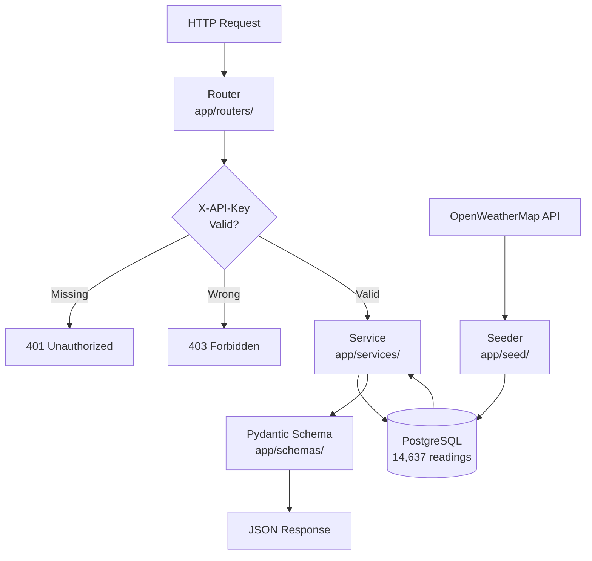
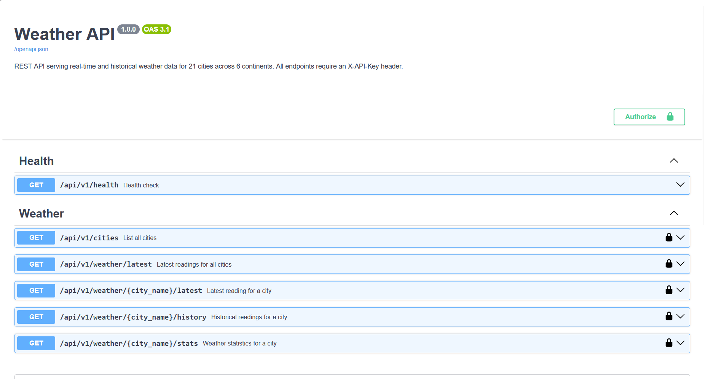
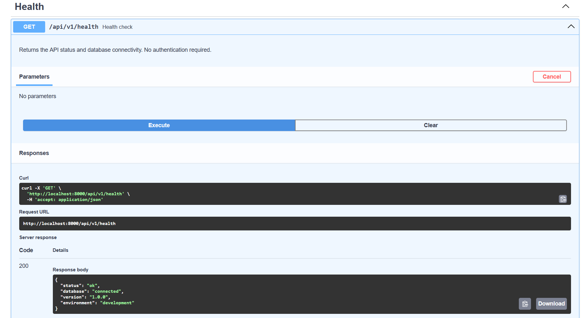
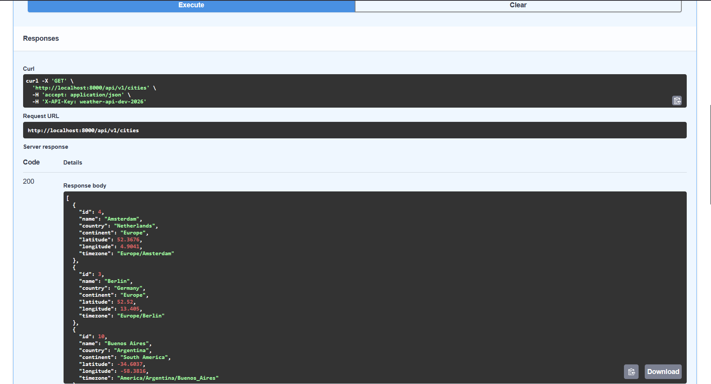
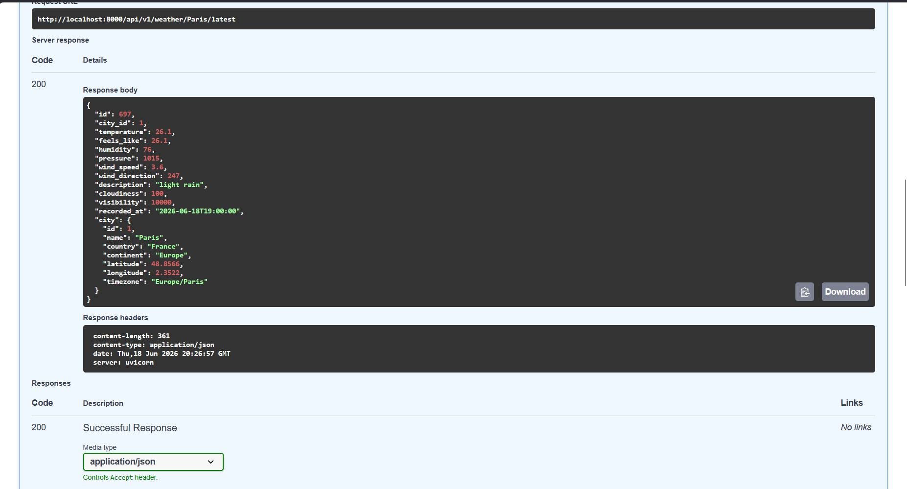
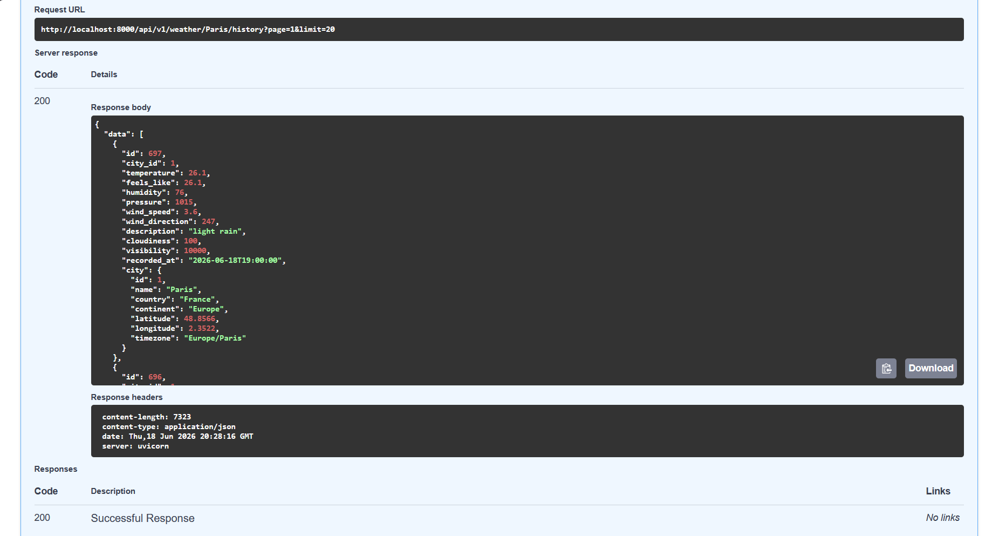
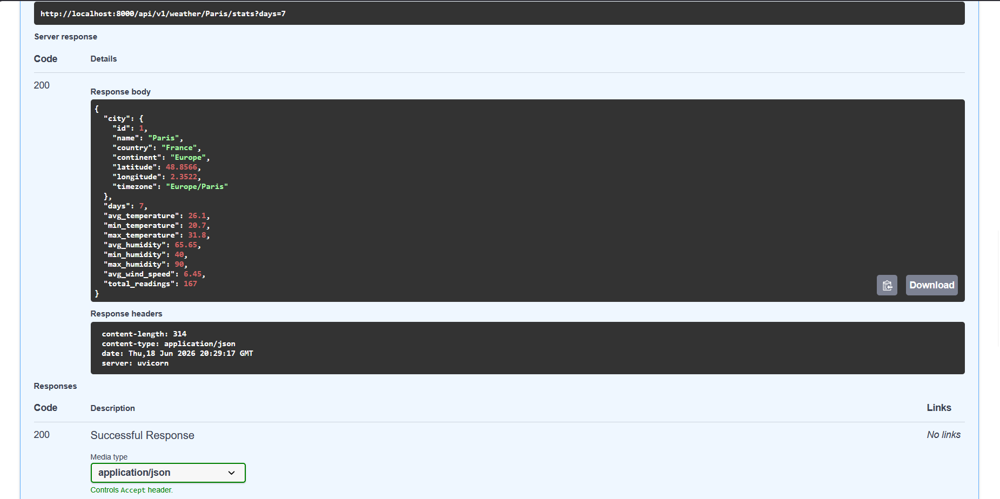
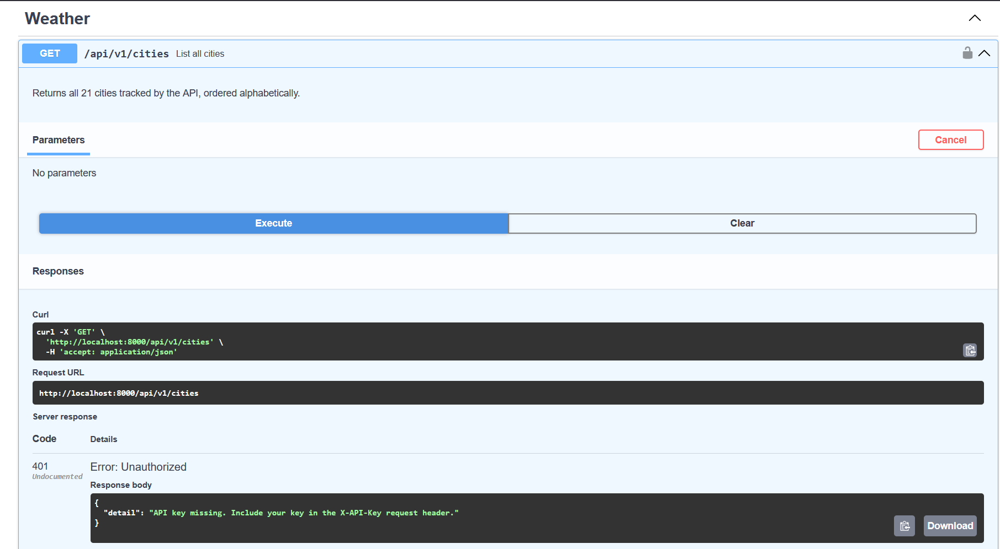
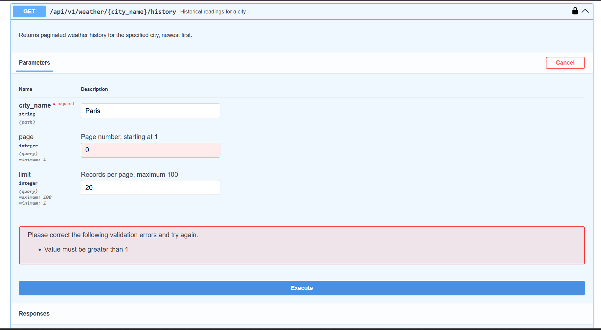
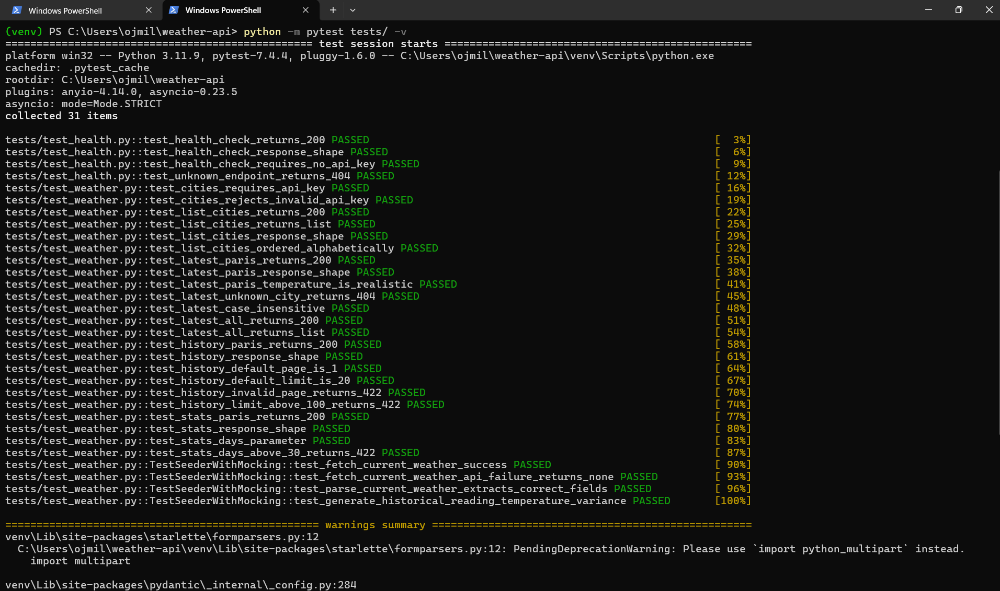

# Weather API


**Live API:** [weather-api-production-1781.up.railway.app/docs](https://weather-api-production-1781.up.railway.app/docs) — interactive Swagger UI, no setup required. Authorize with `weather-api-dev-2026`.

A REST API for weather data across 21 cities and 6 continents. Current conditions come from OpenWeatherMap. Thirty days of hourly history per city sit in PostgreSQL — 14,637 readings total. Every protected endpoint requires an API key. History responses are paginated. Statistics are aggregated inside the database, not in Python. The test suite runs in 0.54 seconds against SQLite with no network access.

The architecture is deliberately layered: models define the schema, schemas control what crosses the API boundary, services own all business logic, and routers do nothing except route. That separation means the same service functions can be called from a CLI, a background job, or a second API version without rewriting logic.

---

## Endpoints

```
GET  /api/v1/health                    No authentication required
GET  /api/v1/cities                    21 cities, ordered alphabetically
GET  /api/v1/weather/latest            Current conditions for every city (optional ?continent= filter)
GET  /api/v1/weather/{city}/latest     Current conditions for one city
GET  /api/v1/weather/{city}/history    Paginated history, newest first
GET  /api/v1/weather/{city}/stats      Aggregated stats over 1–30 days
```

All endpoints except `/health` require an `X-API-Key` request header.

---

## Architecture



```
app/
├── models/       # SQLAlchemy — table definitions, indexes, constraints
├── schemas/      # Pydantic v2 — what enters and leaves the API boundary
├── services/     # All database queries and business logic live here
├── routers/      # HTTP layer — calls services, returns responses, nothing more
├── middleware/   # API key validation via FastAPI Security dependency
└── seed/         # Fetches real OpenWeatherMap data, generates history
tests/
├── conftest.py        # SQLite override, fixtures, test client
├── test_health.py     # Health endpoint contract tests
└── test_weather.py    # Weather endpoints + OpenWeatherMap mock tests
```
The models and schemas are deliberately separate. The database model is concerned with storage — the schema is concerned with what external consumers see. A database refactor should not automatically change the API contract, and an API change should not require a migration. Keeping them separate means each can evolve independently.

---

## Key Engineering Decisions

**Routers are thin by design.**
Every router function does exactly two things: call a service and return the result. No database queries, no error handling beyond what FastAPI does automatically, no business logic. If you read the router you understand the API surface. If you read the service you understand the behaviour. This makes both easier to test and easier to change.

**Stats are computed inside PostgreSQL.**
The `/stats` endpoint uses `func.avg`, `func.min` and `func.max` — all executed inside the database. PostgreSQL returns one row with six computed values. Python never touches individual readings. The alternative — pulling thousands of rows into Python to compute averages — would be an order of magnitude slower and would not scale.

**The composite index on `(city_id, recorded_at)`.**
The most common query pattern is "give me readings for city X ordered by time". Without the composite index, PostgreSQL scans every row in the table. With it, the query uses one index scan regardless of how many cities or readings exist.

**The seeder anchors generated history to real data.**
Current conditions are fetched from OpenWeatherMap for all 21 cities. Historical data is then generated with variation anchored to the real current temperature. A city at 38°C now has a warm history. A city at 9°C now has a cold history. The alternative — hardcoded temperature ranges — would produce history that contradicts the real current reading sitting next to it in the database.

**OpenWeatherMap calls are mocked in tests.**
Tests that make real HTTP calls are flaky. They fail when the network is slow, the API is down, or the rate limit is hit. `unittest.mock.patch` replaces `requests.get` with a controlled fake. The tests verify that the seeder calls the right endpoint with the right parameters, maps response fields correctly, and returns `None` gracefully on failure — none of which requires internet access or consumes API quota.

**Caching is in-memory, not a separate service.**
A single-instance deployment serving 21 cities does not need a distributed cache. An in-memory dictionary with a time-based expiry solves the actual problem — repeated identical queries hitting PostgreSQL — without provisioning, running, or maintaining a separate caching service. The cache interface (`get`, `set`, `clear`) mirrors what a Redis client exposes, so migrating to Redis later, if the API ever runs across multiple instances, is a contained change to one file.

- **Request logging middleware** — every request logged with method, path, status code and response time in milliseconds
- **Structured logging** — centralised logging configuration with timestamps and log levels across all modules
- **Database latency monitoring** — health endpoint measures and returns PostgreSQL round-trip time in milliseconds
- **Alembic migrations** — versioned schema management replacing `create_all` for safe production deployments
- **Request logging middleware** — every request logged with method, path, status code and response time in milliseconds using a Starlette `BaseHTTPMiddleware` — no changes needed in route handlers
- **Structured logging** — centralised `logging_config.py` configures timestamps, log levels and module names once at startup — every module inherits the configuration automatically
- **Database latency monitoring** — the `/health` endpoint measures PostgreSQL round-trip time in milliseconds, distinguishing a slow database from a down one
- **Alembic migrations** — versioned schema management with `upgrade()` and `downgrade()` functions replacing `create_all`, making schema evolution safe in production

---

## Running It

**Requirements:** Python 3.11, Docker Desktop, OpenWeatherMap API key (free at openweathermap.org)

```bash
git clone https://github.com/OjongBessongNKONGHO/weather-api.git
cd weather-api
python -m venv venv
venv\Scripts\activate        # Windows
source venv/bin/activate     # Mac / Linux
pip install -r requirements.txt
```

Copy `.env.example` to `.env` and set two values:
- `API_KEY_SECRET` — any string, sent as `X-API-Key` when calling the API
- `OPENWEATHER_API_KEY` — your OpenWeatherMap key

Start PostgreSQL:

```bash
docker run --name weather-api-db \
  -e POSTGRES_USER=weather_user \
  -e POSTGRES_PASSWORD=weather_password \
  -e POSTGRES_DB=weather_api \
  -p 5432:5432 -d postgres:15
```

Seed the database and start the API:

```bash
make seed   # fetches real weather for 21 cities, generates 30 days of history
make up     # starts the API on http://localhost:8000
```

Interactive documentation at `http://localhost:8000/docs` — click Authorize, enter your `API_KEY_SECRET`, and every endpoint is testable in the browser.

Alternative documentation UI available at `http://localhost:8000/redoc`.

**Full stack with Docker Compose:**

```bash
docker-compose up
```

PostgreSQL starts first. The API waits for the database healthcheck before starting — no manual sequencing needed.

---

## Tests

```bash
make test
```

38 tests. 0.47 seconds. No PostgreSQL, no network.

**tests/test_health.py**
- Health returns 200 with no authentication
- Response contains status, database, version and environment
- Unknown endpoints return JSON 404 with a pointer to /docs

**tests/test_weather.py**
- Missing API key returns 401
- Wrong API key returns 403
- Cities returned alphabetically
- Every schema field verified on every endpoint
- Case-insensitive city lookup — paris, Paris and PARIS resolve identically
- Unknown city returns 404
- page=0, limit=101 and days=31 all return 422 automatically
- Pagination metadata correct on every history response
- Continent filter on /weather/latest returns only matching cities, case-insensitive, empty list for no matches
- In-memory TTL cache on /weather/latest serves identical results on repeated calls and isolates cache keys per continent filter

**tests/test_weather.py::TestSeederWithMocking**
- fetch_current_weather calls the right URL with the right parameters
- fetch_current_weather returns None on network failure without raising
- parse_current_weather maps every OpenWeatherMap field correctly
- generate_historical_reading stays within plausible temperature variance

The four mock tests use `unittest.mock.patch` to intercept `requests.get` before it reaches the network. Each test controls exactly what the fake response contains and verifies the seeder's behaviour in isolation.

---

## What Went Wrong

Three real problems hit during development. They are documented here because the fixes are more instructive than the features.

**500 on `/weather/{city}/latest` — missing SQLAlchemy relationship**

The `WeatherReadingResponse` schema includes a nested `city` object. The `WeatherReading` SQLAlchemy model had a `city_id` foreign key column but no `relationship()` directive. SQLAlchemy had no instruction to load the related city row, so Pydantic failed to serialise the response and FastAPI returned 500.

Fix: added `relationship("City")` to `WeatherReading` and changed `city_id` from a plain `Integer` column to `Integer, ForeignKey("cities.id")`. The ORM could then eager-load the city in the same query. The 500 became a 200.

**`DATA_SOURCE_NOT_FOUND: delta` in CI — Spark session conflict**

In the Spark Structured Streaming project, Delta Lake integration tests passed locally but failed in GitHub Actions. The test suite runs `test_consumer.py` before `test_delta_lake_integration.py`. The consumer tests create a Spark session without the Delta extension loaded. Spark sessions are JVM singletons — the Delta test fixture inherited the existing session, which had no Delta JARs on its classpath.

Fix: set `PYSPARK_SUBMIT_ARGS` at module level in the Delta test file to load the Delta JARs at JVM startup, before any session is created. The environment variable is read by the JVM launcher, not by Python, so it must be set before the JVM initialises.

**winutils.exe error=216 — Spark tests failing locally on Windows**

Hadoop requires `winutils.exe` on Windows to handle filesystem permission calls. The binary at `C:\hadoop\bin\winutils.exe` produced error code 216 — incompatible executable format — which means it was compiled for a different architecture variant despite the machine being 64-bit. The correct binary also requires `hadoop.dll` to be present in the same directory.

Fix: downloaded `winutils.exe` and `hadoop.dll` compiled specifically for Hadoop 3.3.1 from the `kontext-tech/winutils` repository. All 7 Delta Lake integration tests passed locally after replacing both files.

---

## Screenshots

### Swagger UI — All Endpoints with Authentication


### Health Check — 200 OK, Database Connected


### Cities — 21 Cities, Alphabetical Order


### Paris — Real Current Conditions from OpenWeatherMap


### Paris — Paginated History with Metadata


### Paris — Statistics Computed in PostgreSQL


### 401 — Missing API Key


### 422 — Invalid Query Parameter Rejected Automatically


### Test Suite — 38 Passing in 0.47 Seconds


### Seeder — Real Temperatures Fetched for All 21 Cities


---

## Metrics

| | |
|---|---|
| Cities | 21 across 6 continents |
| Weather readings | 14,637 (30 days hourly per city) |
| Current data source | OpenWeatherMap API |
| Tests | 38 passing in 0.47 seconds |
| Authentication | API key — X-API-Key header |
| Rate limit | 60 requests per minute per IP |
| History depth | 30 days, paginated |
| Stats window | 1 to 30 days, configurable |

---

## Stack

| Layer | Technology |
|-------|------------|
| Framework | FastAPI 0.111 |
| Database | PostgreSQL 15 |
| ORM | SQLAlchemy 2.0 |
| Validation | Pydantic v2 |
| Authentication | API key — X-API-Key header |
| Rate limiting | slowapi — 60 requests per minute |
| Testing | pytest, TestClient, unittest.mock |
| Containerisation | Docker, Docker Compose |
| CI | GitHub Actions |
| Language | Python 3.11 |

## Portfolio

This is the sixth project in a backend and data engineering portfolio built throughout 2026.

| Project | Stack |
|---------|-------|
| [Weather ETL Pipeline](https://github.com/OjongBessongNKONGHO/weather-etl-pipeline) | Airflow, PostgreSQL, Docker |
| [Kafka Streaming Pipeline](https://github.com/OjongBessongNKONGHO/kafka-streaming-pipeline) | Kafka, Pydantic v2, PostgreSQL, Docker |
| [AWS Data Platform](https://github.com/OjongBessongNKONGHO/aws-data-platform) | Terraform, AWS, EC2, RDS, S3 |
| [DuckDB Analytics](https://github.com/OjongBessongNKONGHO/duckdb-analytics) | DuckDB, PyArrow, Click, APScheduler |
| [Spark Streaming Pipeline](https://github.com/OjongBessongNKONGHO/spark-streaming-pipeline) | Spark, Kafka, Delta Lake, Terraform, AWS |
| **Weather API** (this repo) | FastAPI, PostgreSQL, SQLAlchemy, Pydantic v2, Docker |

## Author

**Ojong Bessong NKONGHO**
BSc Computer Science, DSTI School of Engineering, Paris
MSc Data Engineering and AI — September 2026

[](https://linkedin.com/in/nkongho-ojong)
[](https://github.com/OjongBessongNKONGHO)
